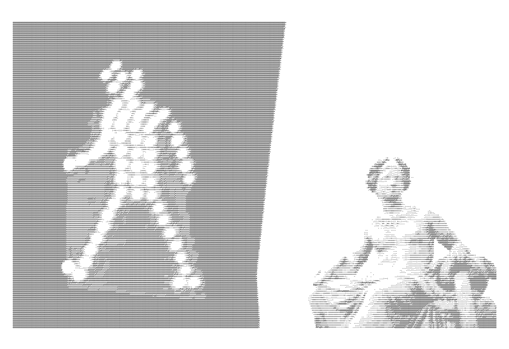

# pg-essays

**Paul Graham's build philosophy, packaged as Agent Skills for coding agents.**

<p align="center">
  
</p>

> Distilled from the essays of **Paul Graham** ([paulgraham.com](https://www.paulgraham.com/articles.html)).
> These skills point to the originals — they don't replace them. See
> [CREDITS.md](./CREDITS.md).

A pack of [Agent Skills](https://platform.claude.com/docs/en/agents-and-tools/agent-skills/overview)
that turn Paul Graham's essays into **planning and build-time guidance for coding
agents** (Claude Code and any Agent-Skills-compatible runtime). They don't lecture
theory — they *bend the plan the agent makes*: simpler, more focused, more
complete, more honest. Each loads only when the task calls for it.

## Install

```bash
# via skills.sh
npx skills add abed42/pg-essays

# or copy the skills straight into a Claude Code / Agent SDK skills dir
cp -r skills/pg-* ~/.claude/skills/
```

## The 12 skills

**Scope & process — how to build**
| Skill | What it does to the agent |
|---|---|
| `pg-do-things-that-dont-scale` | Defers scale/abstraction/infra → builds the simple, manual version first |
| `pg-make-something-people-want` | Cuts speculative scope & gold-plating → builds only what's needed |
| `pg-always-working-code` | Keeps the build green; refines a running prototype; no Hail Mary big-bangs |
| `pg-schlep-blindness` | Won't skip the boring correctness work — errors, edge cases, the last 20% |

**Judgment — what to build**
| Skill | What it does to the agent |
|---|---|
| `pg-idea-review` | Pressure-tests whether an idea/feature is worth building before coding it |
| `pg-product-review` | Reviews whether what's built is actually wanted (demand, not vanity metrics) |

**Design — how to keep it good**
| Skill | What it does to the agent |
|---|---|
| `pg-taste-for-makers` | Simplest design that solves it; delete > add; plain > clever |
| `pg-hold-it-in-your-head` | Keeps the whole system comprehensible as it grows |
| `pg-write-well` | Clarity in names, comments, commits, docs — write for the next reader |

**Operate & ship**
| Skill | What it does to the agent |
|---|---|
| `pg-founder-mode` | Inspects real artifacts instead of trusting "done"; owns the outcome |
| `pg-naming` | Names projects well — generate many, check availability, don't overthink |
| `pg-branding` | Substance over brand — invest in the working thing, not positioning theater |

## How a skill is built

Each `SKILL.md` follows one structure: a **pushy `description`** that routes
(`USE WHEN …`), the **principle** as imperative instruction, **plan/output
review** checks the agent runs against its own work (with **STOP** discipline),
**pushback patterns** (bad → good), **red flags**, a **when-NOT-to-apply** guard,
and **anchor quotes** from PG. Portable frontmatter only — `name` + `description`.

## Design choices

- **Coding-agent voiced.** Every skill instructs the *builder*, shaping the plan —
  not a human founder.
- **Sharp diagnostics over broad summaries.** Each skill bites on real input.
- **Composable.** On a build task, several fire together and stack toward simple,
  wanted, complete, clear.

## Credit

All ideas and quotes are Paul Graham's. This pack is a derivative study aid and is
**not affiliated with or endorsed by Paul Graham.** Per-skill sources in
[CREDITS.md](./CREDITS.md). Read the originals at
[paulgraham.com](https://www.paulgraham.com/articles.html).
